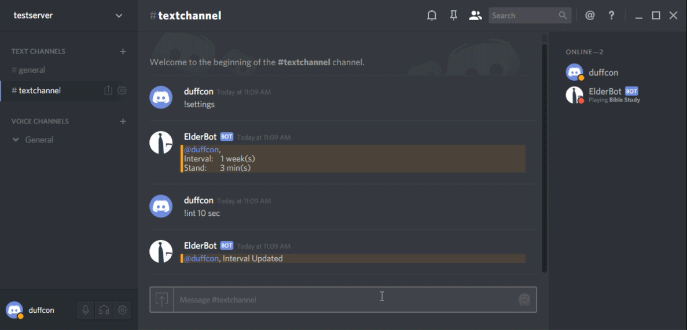
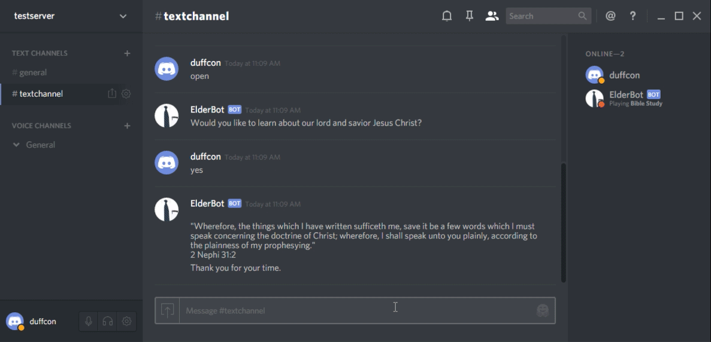

# ElderBot

<p align="center">

</p>

# What is it

ElderBot is your friendly neighbordhood discord bot. He comes knocking on your chat door to help spread the good word. ElderBot has been rigorously studying the Book of Mormon memorzing every letter of every verse. So please open your hearts and doors and get to know ElderBot.

# Demo

ElderBot will knock on your door and wait for you to open it. If you say yes, ElderBot will send a random verse.



If you say no, he will quietly leave. You can also make ElderBot sprint to your door.



You can set the interval at which ElderBot comes knocking and how long ElderBot will wait at the door.


# Subjects

- debian linux
- nodejs
- javascript
- postgresql/databases
- inheritance
- events/event handling
- state machines
- string parsing/regex

# How do I install?

*Prerequisites:*
* [*bot created and added to your discord server*](https://github.com/duffcon/SimpleDiscordBot)
* [*Installed psycopg2 for python*](https://github.com/duffcon/ElderBot/wiki/0.-Psycopg2)


## Clone Repo

```bash
git clone https://github.com/duffcon/ElderBot.git
```
```bash
#Gets ALL branches
for branch in $(git branch --all | grep '^\s*remotes' | egrep --invert-match '(:?HEAD|master)$'); do
    git branch --track "${branch##*/}" "$branch"
done
git fetch --all
git pull --all

cd ElderBot

```


## Book To Base

```bash
git checkout 0.ParseBOM

```

Parses the BOM.txt file and puts it into a database.

### Install postgresql

```bash
sudo apt-get --purge remove postgresql* -y
sudo apt-get install postgresql postgresql-contrib -y

```
### Create User and Database

```bash
sudo su postgres
psql
create user elder with password 'bot';
create database elder with owner=elder connection limit=25;
alter user elder with superuser;
```

```
\q
exit
```


### Run Python Script

```bash
python ParseText.py

```

A random verse should appear in your terminal.


## Setup

```bash
git checkout master
npm install

```


### Insert Super Secret Information


**1. Channel_id:** In Discordright right click on text channel -> Copy ID

**2. User_id:** In Discord, in right hand side panel, right click on your profile -> Copy ID

**3. Bot_token:** On discord developer website where you created your app/bot.

Channel_id is so the bot knows where to send messages. User_id adds permissions to commands.This is an array so you can have multiple users.

```javascript
//index.js
var bot = new elder('prefix', 'Channel_id', ['User_id']);
bot.login('Bot_token');
```

Start it up.
```bash
node .
```

Check [wiki](https://github.com/duffcon/ElderBot/wiki) for more info
